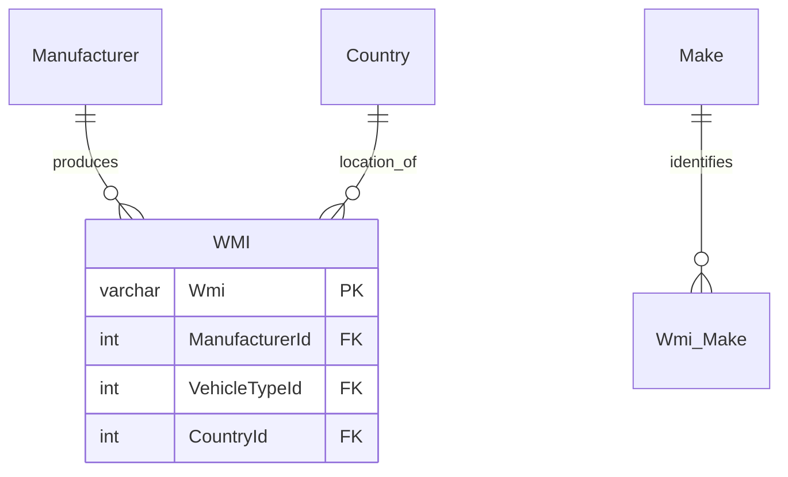
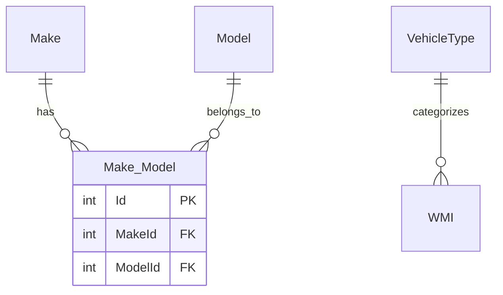
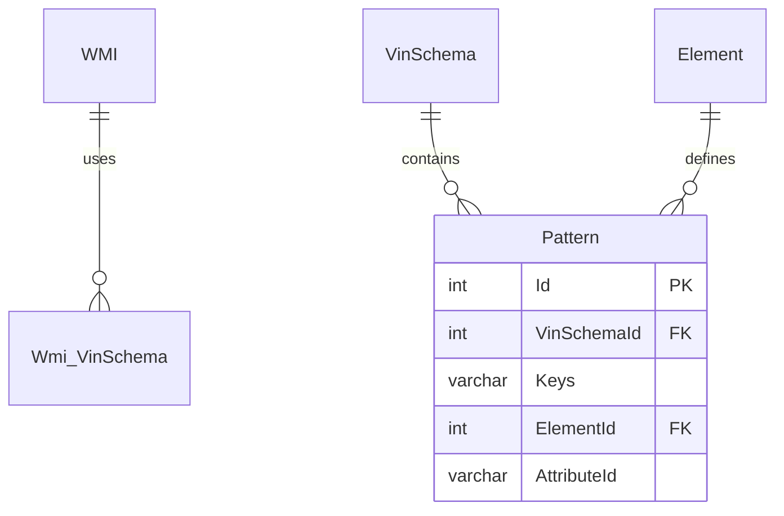

# VPIC Database Structure

## Core Components

The VPIC database is organized around several key components that work together to decode Vehicle Identification Numbers (VINs) and provide vehicle specifications.

### Primary Tables

#### 1. Manufacturer & WMI


The World Manufacturer Identifier (WMI) system is the foundation of VIN decoding:
- `Manufacturer`: Company that produces vehicles
- `WMI`: 3-6 character codes assigned to manufacturers
- `Country`: Manufacturing location
- `Make`: Brand names under manufacturers

#### 2. Vehicle Models


Vehicle model relationships:
- `Make_Model`: Links makes to their models
- `VehicleType`: Categories like Passenger Car, Motorcycle, etc.
- `Model`: Specific vehicle models

#### 3. VIN Pattern Matching


Pattern matching system:
- `VinSchema`: Decoding rules for manufacturers
- `Pattern`: Position-specific matching rules
- `Element`: Decodable vehicle attributes
- `Wmi_VinSchema`: Links WMIs to applicable schemas

### Key Attribute Tables

Essential vehicle specification tables:
- `BodyStyle`: Vehicle body configurations
- `DriveType`: 2WD, 4WD, AWD, etc.
- `EngineModel`: Engine specifications
- `Transmission`: Transmission types
- `FuelType`: Fuel system information
- `VehicleType`: Basic vehicle categories

### Core Fields

#### VinSchema
```sql
CREATE TABLE VinSchema (
    Id int PRIMARY KEY,
    Name varchar(100),
    SourceWMI varchar(6),
    TobeQCed bit
)
```

#### Pattern
```sql
CREATE TABLE Pattern (
    Id int PRIMARY KEY,
    VinSchemaId int,
    Keys varchar(50),
    ElementId int,
    AttributeId varchar(50)
)
```

#### Element
```sql
CREATE TABLE Element (
    Id int PRIMARY KEY,
    Name varchar(100),
    Code varchar(50),
    LookupTable varchar(50),
    GroupName varchar(50),
    DataType varchar(20)
)
```

## VIN Position Reference

Standard 17-character VIN structure:
1. Position 1-3: World Manufacturer Identifier (WMI)
2. Position 4-8: Vehicle Description Section (VDS)
3. Position 9: Check Digit
4. Position 10: Model Year
5. Position 11: Plant Code
6. Position 12-17: Sequential Number

## Data Attribution

This database structure is based on the NHTSA's vPIC (Vehicle Product Information Catalog) system. When using this data, please attribute:

"National Highway Traffic Safety Administration (NHTSA) - Vehicle Product Information Catalog (vPIC)" 